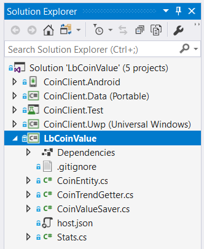
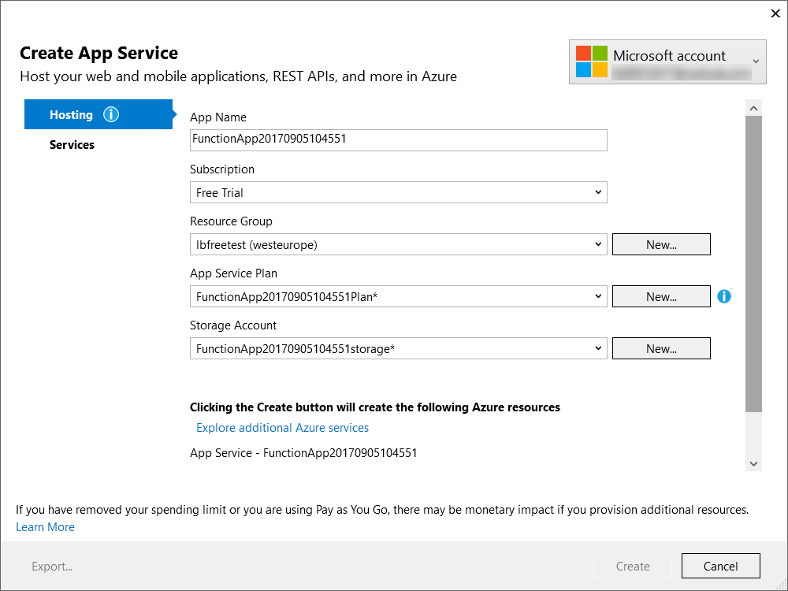
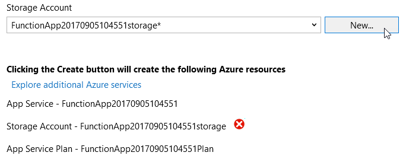
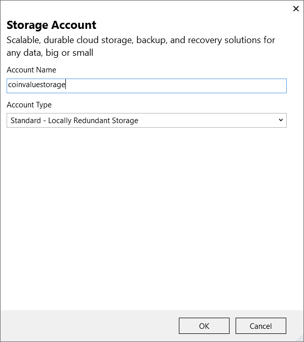

> **Note** This Readme is unfinished.

# Xamarin and Azure Function Sample: Coin Value

This sample shows two Azure Functions:

- A Timer Triggered function used to save bitcoin value every hour to an Azure Table
- Am HTTP Triggered function used to get the current bitcoin value as well as the current trend (up, flat, down) calculated over the last 10 samples.

In addition you will find a Xamarin application for Android and for Windows Universal (UWP) connecting to the HTTP Triggered function and displaying the result.

In order to execute this sample, you need to deploy it to Azure. If you don't have an account yet, [you can follow the steps here to create one](trial-account.md).

## Opening and building the sample

Once your subscription is active, and you cloned and checked out this repository locally, open the solution file at LbCoinValue\LbCoinValue.sln.

The solution consists of 5 projects:

### Server project:

* **LbCoinValue** is the Azure Function application. We will deploy this app to Azure in a few minutes.

### Client projects

The client projects are built according to the Model-View-ViewModel pattern and [use the MVVM Light Toolkit](http://www.mvvmlight.net). However they could be built using any MVVM framework, or even using the MVC pattern instead. 

* **CoinClient.Data** is a portable class library with code shared by the Android and Windows apps.
* **CoinClient.Android** is the Xamarin.Android application. You can deploy this app to an Android device or to an emulator as we will see later.
* **CoinClient.Uwp** is the Windows 10 Universal application. This app can be deployed to your local machine (if you are running Windows 10), to an emulator or to a Windows mobile device.
* **CoinClient.Test** is a unit test application with a basic test, demonstrating how the ViewModel can be tested.

Once the solution is built without errors, we will now deploy it to Azure.

## Deploying the Function app to Azure

To deploy to Azure, follow the steps:

1. In the Solution Explorer, right click on the LbCoinValue project and select Publish from the context menu.

2. In the Publish window, select Azure Function App, and Create New. Then press the Publish button.

3. In the Create App Service window, check if you are already logged in with the correct account (top right). If that is the case, you can jump to step 9 below.

4. Alternatively, add your account by selecting the corresponding choice on the top right.

5. In the window titled "Sign in to your account", select "Use another account".

6. Enter the username for your Microsoft account. For instance, this can be an outlook.com email address. For more details, see [Creating a trial account and a resource group in Azure](trial-account.md).

7. Depending on your account type, you can either enter the password in the same window, or you will be redirected to a different window.

8. After signing in, you will be back to the "Create App Service" window and the values should be pre-populated. You can select [the Resource Group that you created earlier](trial-account.md).

At this point you will probably have an error: The Storage account name may only contains lowercase letters and numbers. But the name entered by default is capitalized.

9. To solve this, you need to click on the "New" button next to the Storage account field.

10. Enter a name between 3 and 24 characters, with only lower-case letters and numbers. Then press OK.

11. In the Create App Service window, press Create.

12. 

## Running the client application

### On Windows

### On Android

**To be continued**

