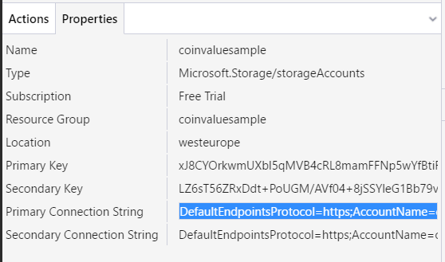
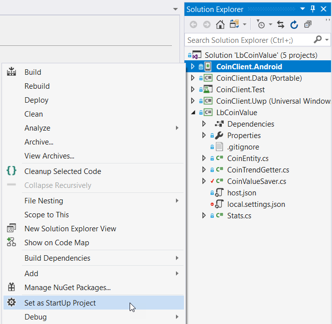

# Xamarin and Azure Function Sample: Coin Value

This sample shows two Azure Functions:

- A **Timer Triggered** function used to save bitcoin value every hour to an Azure Table
- An **HTTP Triggered** function used to get the current bitcoin value as well as the current trend (up, flat, down) calculated over the last 10 samples.

In addition you will find a Xamarin application for Android and for Windows Universal (UWP) connecting to the HTTP Triggered function and displaying the result. An iOS application is in the works.

In order to execute this sample, you need to deploy it to Azure. If you don't have an account yet, [you can follow the steps here to create one](trial-account.md).

## Opening and building the sample

Once your subscription is active, and you cloned and checked out this repository locally, open the solution file at LbCoinValue\LbCoinValue.sln.

The solution consists of 5 projects:

### Server project:

* **LbCoinValue** is the Azure Function application. We will deploy this app to Azure in a few minutes.

### Client projects

The client projects are built according to the Model-View-ViewModel pattern and [use the MVVM Light Toolkit](http://www.mvvmlight.net). However they could be built using any MVVM framework, or even using the MVC pattern instead. 

* **CoinClient.Data** is a portable class library with code shared by the Android and Windows apps.
* **CoinClient.Android** is the Xamarin.Android application. You can deploy this app to an Android device or to an emulator as we will see later.
* **CoinClient.Uwp** is the Windows 10 Universal application. This app can be deployed to your local machine (if you are running Windows 10), to an emulator or to a Windows mobile device.
* **CoinClient.Test** is a unit test application with a basic test, demonstrating how the ViewModel can be tested.

## Copying the Connection String

In order for the Functions to connect to the Azure Table where the data will be stored, we need a connection string. If you worked with databases before, you are familiar with this term: It carries all the information for a database client to connect to the server. 

In our case, [we created a Storage account earlier](trial-account.md) (or you might have one lying around that you can use for this purpose).

To find the Connection string, we will use a very convenient tool called the Microsoft Azure Storage Explorer. If you don't have this tool installed already, [follow the steps here](azure-explorer.md).

1. In the Microsoft Azure Storage Explorer, make sure that you are logged with the account that you want to use. Then navigate to the Storage account that you want to use (if you don't have a Storage account yet, [follow these steps](trial-account.md)).

2. With the Storage account selected, check the Properties tab at the bottom of the window. One of the properties is named "Primary Connection String".

3. Copy the value of the Primary Connection String and then switch to Visual Studio/

4. Open the file named "CoinValueSaver.cs" in the LbCoinValue solution.

5. Replace the value of the ConnectionString constant in the code, from "[ENTER YOUR CONNECTION STRING HERE]" to the value that you just copied from the Microsoft Azure Storage Explorer.

6. Build the solution.

Once the solution is built without errors, we will now deploy it to Azure.

## Deploying the Function app to Azure

To deploy to Azure, follow the steps:

1. In the Solution Explorer, right click on the LbCoinValue project and select Publish from the context menu.

2. In the Publish window, select Azure Function App, and Create New. Then press the Publish button.

3. In the Create App Service window, check if you are already logged in with the correct account (top right). If that is the case, you can jump to step 9 below.

4. Alternatively, add your account by selecting the corresponding choice on the top right.

5. In the window titled "Sign in to your account", select "Use another account".

6. Enter the username for your Microsoft account. For instance, this can be an outlook.com email address. For more details, see [Creating a trial account and a resource group in Azure](trial-account.md).

7. Depending on your account type, you can either enter the password in the same window, or you will be redirected to a different window.

8. After signing in, you will be back to the "Create App Service" window and the values should be pre-populated. You can select [the Resource Group that you created earlier](trial-account.md).

9. Modify the App Name to suit your needs, for example CoinValue.

10. Make sure that the subscription is selected correctly. If you have [followed the instructions to create a free subscription](trial-account.md), make sure that it is selected.

11. Make sure that the correct Storage account is selected.

12. Click the Create button.

This will trigger the first publication of the sample Function application. After a short wait, we will check if everything was installed correctly and talk about the client applications.

## Checking that everything went well

You can [open the Azure Portal](https://portal.azure.com) to check if everything was published correctly.

1. On the left, select the "Function Apps" menu.

2. You should see one function application named CoinValue. Expand it.

3. Under Functions, you should see two functions: CoinTrendGetter and CoinValueSaver.

4. Select the CoinValueSaver function. On the left, above the code, click on the Run button.

5. In the logs, make sure that everything went well. You should see something like the following:

Logs:

    2017-09-06T15:43:34  Welcome, you are now connected to log-streaming service.
    2017-09-06T15:44:10.147 Function started (Id=f29427fe-ac8f-4726-b7f5-d6bf57fd85b1)
    2017-09-06T15:44:10.341 CoinValueSaver executed at: 9/6/2017 3:44:10 PM
    2017-09-06T15:44:12.307 Function completed (Success, Id=f29427fe-ac8f-4726-b7f5-d6bf57fd85b1, Duration=2156ms)

6. Change to the Microsoft Azure Storage Explorer and click on Refresh All.

7. Make sure that the Tables node is expanded under the Storage account of which you just copied the Connection string.

8. You should see a Table named coins. This table was just created by the CoinValueSaver function when you ran the code, and one value was inserted. You can make sure that there is indeed one value, and that all the columns make sense (for example the timestamp).

> Note that the timestamp is entered in Zulu time. This is also known as UTC time, and corresponds to PST + 7 or CET - 2.

## Running the client applications

At the moment, there are two client applications. The first one is developed with Xamarin.Android and the second is a Windows Universal (UWP) app. A Xamarin.iOS application will be published soon, but in effect this is exactly the same as the Android application.

>For more information about how these applications are developed, please check these documents:
>
>* [Building the Function application](building.md)
>* [Building the data access layer](building-data.md)
>* [Building the Xamarin.Android application](building-android.md)
>* [Building the Windows Universal application](building-uwp.md)

### Running the Android client

For Xamarin.Android, you will either need a physical android device, or an emulator on your computer. Note that the application is built using Android 6.0 Marshmallow, so you will need a device or emulator that is running this version or a more recent one. If needed, you can downgrade to an older version of the Android SDK with the following steps:

**Only if needed**

1. Right click on the project titled CoinValue.Android.
2. Select Properties from the context menu.
3. Make sure that the Application tab is selected on the left.
4. Change the value of the combobox titled "Compile using Android version".

Now you can run the application in the Android emulator with these steps:

1. In the Solution explorer, right click on the project named CoinClient.Android, and select Set as Startup Project.

2. On top of the window, make sure that the correct Android emulator is selected.

3. Press F5 to debug, or Ctrl-F5 to run the application in the emulator. Then press the Refresh button.

### Running the Windows client

**To be continued**

