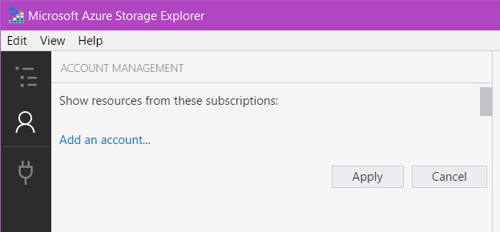
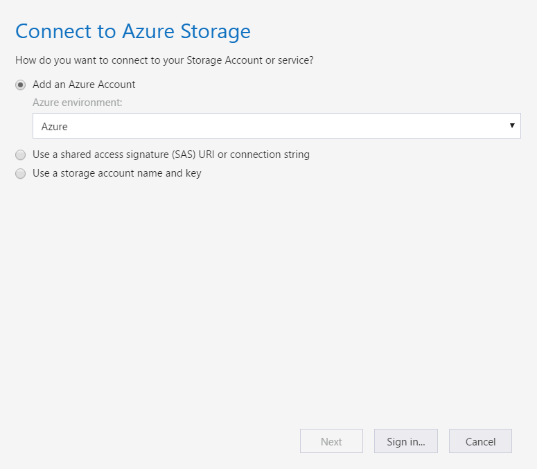
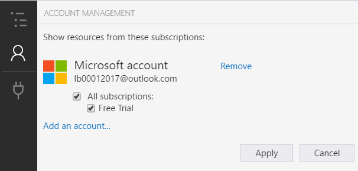
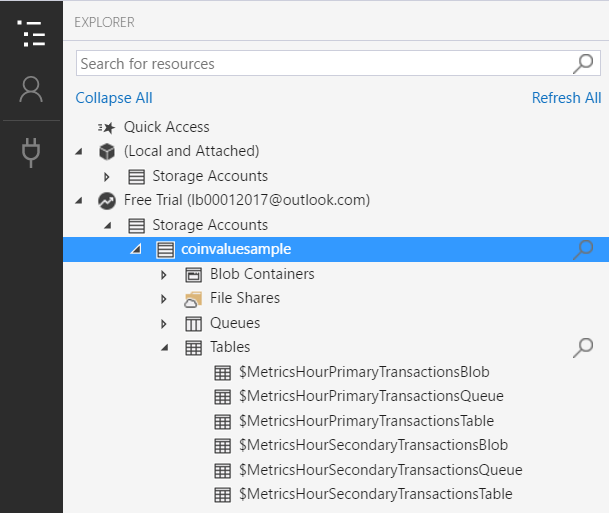

# Installing and configuring the Microsoft Azure Storage Explorer

The Microsoft Azure Storage Explorer is a convenient Windows application that you can use to explore your queues, blobs, file shares and databases in your Azure subscription. This very convenient tool allows you to create new storage accounts, inspect all your data to find issues, make sure that everything is working properly etc.

You can install [from this website](https://azure.microsoft.com/en-us/features/storage-explorer/). After you install the tool on your development machine, start the explorer.

1. Click on "Add an account".

2. Select Azure from the combobox in the "Connect to Azure Storage" window, unless the account you want to use is stored elsewhere. Then press "Sign in".

3. Enter your account details. In case you still don't have an Azure account and an active subscription, [you can follow the steps here](trial-account.md).

4. In the Microsoft Azure Storage Explorer's main window, you should now see the subscriptions for your account. If you have followed the instructions to get a free trial subscription, you should now see it.

> **Note:** If you don't see your subscription, make sure that the Microsoft Azure Storage Explorer window is maximized.

5. You can now explore your data.

